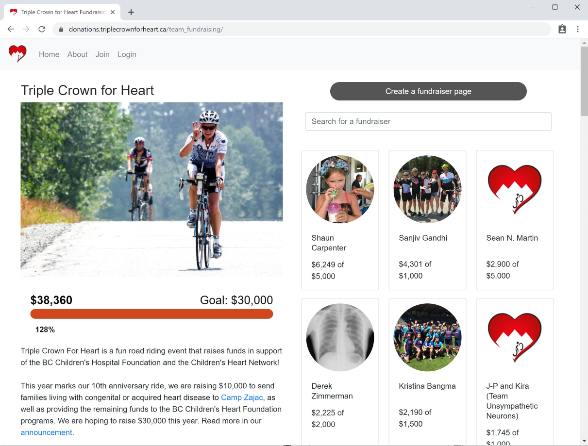

# Event Fundraising Website

An event fundraising website where individuals can create personal pages, set goals and raise money for the overall goal.

Built in Python/Django 2.2 and Bootstrap 4 for the [Triple Crown for Heart](https://triplecrownforheart.ca/) bike ride, because you shouldn't be charged for charity fundraising.

Currently used at: [https://donations.triplecrownforheart.ca/team_fundraising/](https://donations.triplecrownforheart.ca/team_fundraising/). If you would like to use this platform for your charity fundraising event, please contact the [author](#authors).

## Table of Contents

* [Features](#features)
* [Installing](#installling)
* [Deployment](#Deployment)
* [Support](#Support)
* [Build with](#Built-with)
* [Contributing](#Contributing)
* [Authors](#Authors)
* [License](#License)
* [Acknowledgments](#Acknowledgments)

## Features

* Fully responsive website that supports phones, tablets and computers
* Integration with PayPal for donations
* Individuals can create custom fundraising pages with a photo, message and fundraising goal
* Email notifications to the fundraiser whenever a donation is received

## Installing

### Prerequisites

* [Python 3.7](https://www.python.org/)
* [git](https://git-scm.com/)

### Local installation

1. (optional) Create and activate a [virtualenv](https://virtualenv.pypa.io/) to have an isolated environment (you may want to use [virtualenvwrapper](http://virtualenvwrapper.readthedocs.org/)).

2. Clone this repository:

   `git clone https://github.com/dominikszopa/fundraising.git`
   `cd fundraising-website`

3. Install dependencies:

   `pip install -r requirements.txt`

4. Copy .env.example to .env:

   `cp .env.example .env`

5. Edit .env and add a SECRET_KEY value, a long (32 chars or more) random string.

6. Create a database:

   `python3 ./manage.py migrate`

7. Create a superuser - please use a strong password:

   `python3 ./manage.py createsuperuser`

8. Load test data into the database from fixtures:

   `python3 ./manage.py loaddata startingdata`

9. If everything installed, you should be able to start the Django development server:

   `python3 ./manage.py runserver localhost:8000`

10. You can browse to [http://localhost:8000/team_fundraising/](http://localhost:8000/team_fundraising/)

### Email

In order to send out emails when someone registers, makes a donation or receives a donation, you need to provide a mail server. A Gmail account can be used for this. Edit the .env file and add EMAIL_HOST, EMAIL_PORT, EMAIL_HOST_USER and EMAIL_HOST_PASSWORD.

### PayPal

The website uses [django-paypal](https://django-paypal.readthedocs.io/en/stable/) to process donations. To test PayPal without having to make payments each time, you can create a sandbox account from the [PayPal Developer Site](https://developer.paypal.com/developer/accounts/). You can then add the sandbox "business account" to PAYPAL_ACCOUNT in the .env file. You can use a sandbox "personal buyer account" to make test donations.

Django-paypal uses [Instant Payment Notification](https://django-paypal.readthedocs.io/en/stable/standard/ipn.html) (IPN) meaning that PayPal will make a request to the app if a transaction is successful. For this to work on a development environment, you need to be using the system from a domain that accepts incoming connections. The easiest way to do this is using [serveo](https://serveo.net/) or [ngrok](https://ngrok.com/).

## Deployment

I'll add more details later or when someone else wants to deploy the app, but the general steps are:

* Get a server and domain through providers like [Digital Ocean](https://www.digitalocean.com/) or [Heroku](https://www.heroku.com/)

* Follow steps 1-8 from [installing](#installing) above.

* Add environment variables or edit the .env file for production settings.

* Collect static files for production:

  `python manage.py collectstatic`

* Set up nginx, Gunicorn and supervisor as detailed in the [simple is better than complex](https://simpleisbetterthancomplex.com/tutorial/2016/10/14/how-to-deploy-to-digital-ocean.html) article.

If you have difficulties, please feel free to contact the [#author](author).

## Support

For any issues installing, using or contributing, please feel free to contact the [author](#authors).

## Built with

* [Python 3.7](https://docs.python.org/3/) - Primary language
* [Django 2.2](https://docs.djangoproject.com/en/2.2/) - Web Framework
* [django-paypal](https://django-paypal.readthedocs.io/en/stable/) - Payment processor
* [Bootstrap 4](https://getbootstrap.com/docs/4.0/getting-started/introduction/) - Interface
* [django-crispy-forms](https://django-crispy-forms.readthedocs.io/en/latest/) - Bootstrap forms
* [CKEditor 4](https://ckeditor.com/ckeditor-4) - WYSIWYG editor

## Contributing

If you belong to a charity or non-profit event that has a fundraising component and would like to use this platform for your event, the author can help you get set up. This will also help development by making the product more easily adaptable to events.

If you are a Django/Python or CSS developer, we have a healthy list of features we would like to implement in the [TODO](TODO) file. I may move that to a ticket tracker if a few people join. The author will approve pull requests for the time being. I am also looking for designer help to clean up the design and make a nicer "thermometer".

This project has adopted the [Contributor Covenant](https://www.contributor-covenant.org), version 1.4, available at [https://www.contributor-covenant.org/version/1/4/code-of-conduct.html](https://www.contributor-covenant.org/version/1/4/code-of-conduct.html)

## Authors

* **Dominik Szopa** - *Django, HTML, CSS* - [DominikSzopa](https://github.com/dominikszopa) - <techdomi@gmail.com>

## License

This project is licensed under the [MIT License](LICENSE).

## Acknowledgments

* [Horizontal Fundraising Thermometer](https://codepen.io/robotballoon/pen/Fjnyp) by [Robot Balloon](https://codepen.io/robotballoon)
* [Simple jQuery Search Filter](https://codepen.io/alexerlandsson/pen/ZbyRoO) by [Alexander Erlandsson](https://codepen.io/alexerlandsson)
* The many useful articles at [simple is better than complex](https://simpleisbetterthancomplex.com/) by [Vitor Freitas](https://simpleisbetterthancomplex.com/about/)
